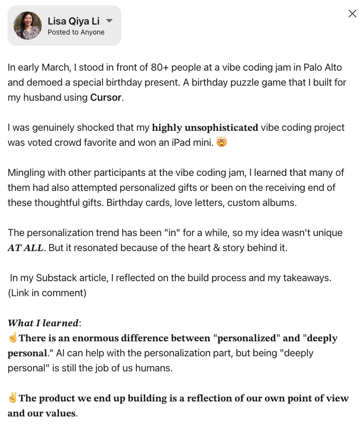

# linkedin-fancy-text — Claude Code Skill

Have you ever wondered how others post with fancy text (e.g., bold, italics) on LinkedIn? 🙋 

I did, and I asked around until a friendly shared an online guide.

But the guide was long, and I didn't want to read it. So I dropped the link into Claude Code and turned it into a skill I can use to copy-paste formatted LinkedIn posts instead.

Claude Code one-shotted the skill. 💥

No more lengthy user guides. 

Nobody wants to read. A skill should just handle it.

---

## Before & After

<table>
  <tr>
    <th>Before — plain text with markers</th>
    <th>After — paste into LinkedIn</th>
  </tr>
  <tr>
    <td></td>
    <td></td>
  </tr>
</table>

---

## How It Works

LinkedIn doesn't support markdown. But Unicode mathematical characters *look* like bold and italic text, and they paste correctly into LinkedIn.

Mark up your post, run `/linkedin-format`, and you get copy-paste-ready Unicode back.

---

## Format Markers

| Marker | Result |
|--------|--------|
| `**text**` | 𝐛𝐨𝐥𝐝 |
| `_text_` | 𝑖𝑡𝑎𝑙𝑖𝑐 |
| `***text***` | 𝒃𝒐𝒍𝒅 𝒊𝒕𝒂𝒍𝒊𝒄 |

Everything else — punctuation, emoji, numbers, line breaks — passes through unchanged.

---

## Installation

Copy the `linkedin-format` folder into your Claude Code skills directory:

```
~/.claude/skills/linkedin-format/
```

Requires Python 3.6+. No dependencies.

---

*Built with Claude Code.*
