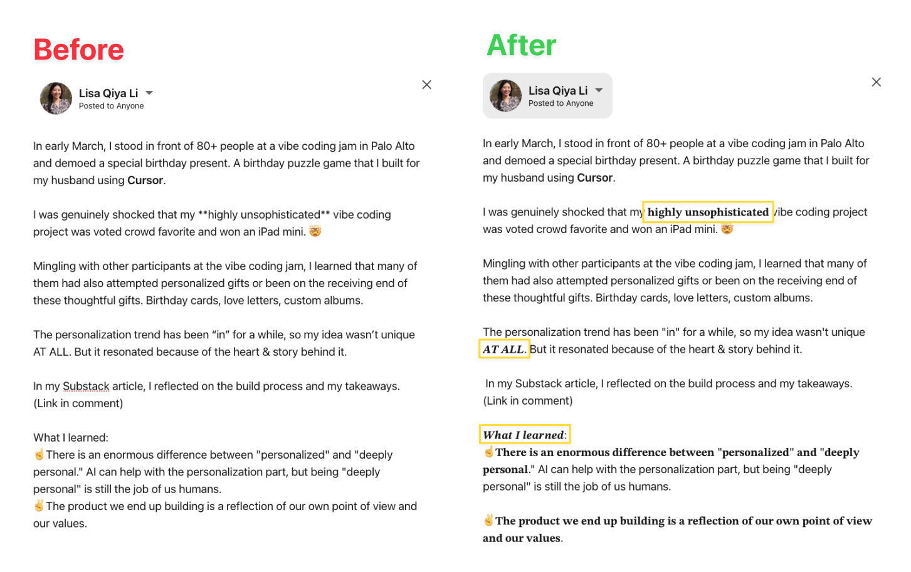

# linkedin-fancy-text — Claude Code Skill

Have you ever wondered how others post with fancy text (e.g., bold, italics) on LinkedIn? 🙋 

I did, and I asked around until a friendly shared an online guide.

But the guide was long, and I didn't want to read it. So I dropped the link into Claude Code and turned it into a skill I can use to copy-paste formatted LinkedIn posts instead.

Claude Code one-shotted the skill. 💥

No more lengthy user guides. 

Nobody wants to read. A skill should just handle it.

---

## Before & After



---

## How It Works

LinkedIn doesn't support markdown. But Unicode mathematical characters *look* like bold and italic text, and they paste correctly into LinkedIn.

Run `/linkedin-fancy-text`, give Claude your post, and you get copy-paste-ready Unicode back.

---

## Three Ways to Use This

**Use case 1 — Paste raw text, describe what to format**

Paste your post as-is. Claude will ask what you want bolded or italicized, and you describe it in plain English.

> *"Bold the first line and bold italic 'AT ALL'"*

**Use case 2 — Point to a Markdown or Obsidian file**

Give Claude the file path. It reads your existing `**markers**` and converts them automatically.

> *"Format this: `~/Documents/my-post.md`"*

**Use case 3 — Point to a Word doc**

Give Claude the `.docx` path. It reads exactly what you bolded and italicized in Word and converts it to Unicode — no re-formatting needed.

> *"Format this: `~/Documents/my-post.docx`"*

---

## Pro Tip — Enable Fullscreen Mode

Editing text inside a terminal is annoying by default. You can't click to place your cursor — you're stuck pressing arrow keys to reach the word you want to fix.

Claude Code's fullscreen mode fixes this. Enable it once:

```bash
# Run once in the current session
/tui fullscreen

# Or make it permanent in ~/.claude/settings.json
{
  "env": {
    "CLAUDE_CODE_NO_FLICKER": "1"
  }
}
```

With fullscreen mode on, you can click anywhere in your input to place your cursor — mid-sentence, mid-word, wherever. Makes editing your post inside the terminal feel normal.

---

## Installation

Copy the `linkedin-fancy-text` folder into your Claude Code skills directory:

```
~/.claude/skills/linkedin-fancy-text/
```

Requires Python 3.6+. No dependencies.

---

*Built by Lisa Qiya Li with Claude Code.*
